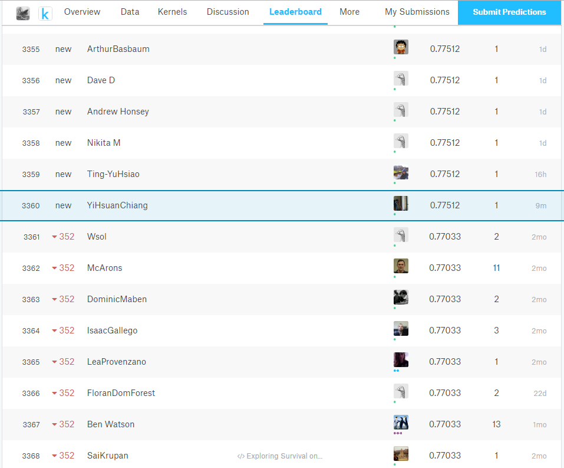

```{r setup, include=FALSE}
knitr::opts_chunk$set(echo = TRUE)
```

#資料讀取-使用 read.csv() 函數讀入資料集
```{r}
url = "https://storage.googleapis.com/2017_ithome_ironman/data/kaggle_titanic_train.csv"
titanic <- read.csv(url)
```

**描述性統計**
```{r}
summary(titanic)
```

**資料清理並補值-Age 變數有 177 個遺漏值，只留下完整的觀測值訓練;而Embarked 有兩個空值，以 S 填補**
```{r}
titanic <- titanic[complete.cases(titanic), ]
titanic$Survived <- factor(titanic$Survived)
titanic$Embarked <- as.character(titanic$Embarked)
titanic$Embarked[titanic$Embarked == ""] <- "S"
titanic$Embarked <- factor(titanic$Embarked)
```

**建立一個分類模型-用 randomForest() 函數建立一個隨機森林分類模型來預測 Survived 變數**
**切分訓練與測試資料**
```{r}
set.seed(87)
n <- nrow(titanic)
shuffled_titanic <- titanic[sample(n), ]
train_indices <- 1:round(0.7 * n)
train <- shuffled_titanic[train_indices, ]
test_indices <- (round(0.7 * n) + 1):n
test <- shuffled_titanic[test_indices, ]
```

**建立分類器**
```
{rlibrary(randomForest)
rf_clf <- randomForest(Survived ~ Pclass + Sex + Age + SibSp + Parch + Fare + Embarked, data = train, ntree = 100)
```

**計算 accuracy**
```prediction <- predict(rf_clf, test[, c("Pclass", "Sex", "Age", "SibSp", "Parch", "Fare", "Embarked")])
confusion_matrix <- table(test$Survived, prediction)
accuracy <- sum(diag(confusion_matrix)) / sum(confusion_matrix)
accuracy```


##探索沒有答案的上傳資料
```{r}
url <- "https://storage.googleapis.com/py_ds_basic/kaggle_titanic_test.csv"
to_predict <- read.csv(url)
summary(to_predict)
```

**填補遺漏值-Fare 用平均值填滿;Age 依照 Pclass 的平均年齡填滿**
```{r}
library(dplyr)
library(magrittr)
```

**Fare**
```{r}
fare_mean <- mean(to_predict$Fare, na.rm = TRUE)
to_predict$Fare[is.na(to_predict$Fare)] <- fare_mean
```

**Age**
```{r}
mean_age_by_Pclass <- to_predict %>%
  group_by(Pclass) %>%
  summarise(mean_age = round(mean(Age, na.rm = TRUE)))
filter_1 <- is.na(to_predict$Age) & to_predict$Pclass == 1
filter_2 <- is.na(to_predict$Age) & to_predict$Pclass == 2
filter_3 <- is.na(to_predict$Age) & to_predict$Pclass == 3
mean_age_by_Pclass
```

```{r}
to_predict[filter_1, ]$Age <- 41
to_predict[filter_2, ]$Age <- 29
to_predict[filter_3, ]$Age <- 24
```

**Summary after imputation**
```{r}
summary(to_predict)
```

###準備上傳
```predicted <- predict(rf_clf, newdata = to_predict[, c("Pclass", "Sex", "Age", "SibSp", "Parch", "Fare", "Embarked")])
to_submit <- data.frame(to_predict[, "PassengerId"], predicted)
names(to_submit) <- c("PassengerId", "Survived")
head(to_submit, n = 10)```

```write.csv(to_submit, file = "to_submit.csv", row.names = FALSE)```

#競賽結果


